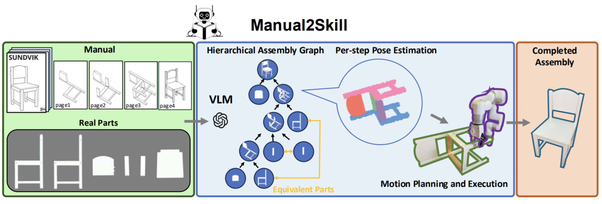

<h2 align="center"> <a href="https://owensun2004.github.io/Furniture-Assembly-Web/">Manual2Skill: Learning to Read Manuals and Acquire Robotic Skills for Furniture Assembly Using Vision-Language Models</a>
</h2>

<h5 align="center">

[Chenrui Tie](https://crtie.github.io/),
[Shengxiang Sun](https://owensun2004.github.io/),
[Jinxuan Zhu](https://www.linkedin.com/in/jinxuan-zhu-08a8972b7/),
[Yiwei Liu](https://lew1sin.github.io/),
[Jingxiang Guo](https://borisguo6.github.io/),
[Yue Hu](https://blog.csdn.net/xyyxyyx),
[Haonan Chen](https://github.com/chenhn02),
[Junting Chen](https://sgtvincent.github.io/),
[Ruihai Wu](https://warshallrho.github.io/),
[Lin Shao](https://linsats.github.io/)

`<font color="black"><strong>`RSS 2025`</strong></font>`

[](https://arxiv.org/abs/2502.10090)
[](https://owensun2004.github.io/Furniture-Assembly-Web)
[](https://colab.research.google.com/drive/15XH8jhqodE4-GuiIe_IRrwjaeZt6uiQj?usp=sharing)

This is the official implementation of **[Manual2Skill](https://owensun2004.github.io/Furniture-Assembly-Web)**, a novel framework that enables robots to perform complex assembly tasks guided by high-level manual instructions.

</h5>



## Getting Started

This repository contains code for the 2 critical sections of Manual2Skill:

1. **Hierachical Assembly Graph Generation**
2. **Per-step Assembly Pose Estimation**

### Installation

1. Clone repository:

```bash
  git clone https://github.com/owensun2004/Manual2Skill.git
  cd Manual2Skill
```

2. Install dependencies:

```bash
conda create -n manual python=3.11
conda activate manual
pip install -r requirements.txt

# for blender rendering of variations in pre-assembly scene
wget https://download.blender.org/release/Blender3.6/blender-3.6.19-linux-x64.tar.xz
tar -xf blender-3.6.19-linux-x64.tar.xz
cd blender-3.6.19-linux-x64
sudo ln -s $(pwd)/blender /usr/local/bin/blender
cd ..
rm blender-3.6.19-linux-x64.tar.xz
```

3. OpenAI API Key

```bash
export OPENAIKEY="your-api-key"
```

## Hierachical Assembly Graph Generation

This section includes scripts for generating variations in pre-assembly scene, running VLM inference on the 102 furniture to generate hierachical assembly graphs, and performing evaluation for VLM generated results.

```bash
cd VLM_assembly_graph_gen
```

### Data Preparation

Download and extract data for 102 furniture manuals and pre-assembly scenes:

```bash
mkdir data
gdown https://drive.google.com/uc?id=1hPesH_zd_NMd842JGaXaUxkviLU2Th4L
unzip data.zip -d ./data
```

### Pre-assembly scene generations

This section explains how to use Blender to generate variations pre-assembly scenes:

```bash
python scene_gen/generator.py --rand_translate true --rand_rotate true
```

- `--rand_translate true` randomly shuffles furniture parts
- `--rand_rotate true` randomly rotates furniture parts in place
- If neither argument is specified, original pre-assembly scenes from `data/preassembly_scenes` will be generated again

Generated scenes are saved as `scene_rot.png` and `scene_rot_annotated.png` under `data/preassembly_scenes` for each furniture item. Each run produces unique scenes due to randomness.

### VLM inference

This section explains how to generate assembly graphs for each furniture.  Each furniture item uses approximately 15 images and 1700 words, taking around 1-2 minutes per item.

**Example (default parameters with original pre-assembly scene for all furniture):**

```bash
python inference/run.py 
```

Outputs will be stored in `outputs/[timestamp]/` with each furniture item containing a `tree.json`, which stores the predicted assembly graph in a nested array.

**Custom Parameters Example**

```bash
python inference/run.py \
--start 0 \
--end 2 \
--temperature 0.1 \
--model o1 \
--prompt_type not_numbered \
--scene_type varied \
--debug
```

Parameters

- `--start` and `--end`: Furniture item index (0-101) if you want to inference on a specific subset of furniture
- `--temperature`: Controls generation randomness (0-1)
- `--model`: Selects from `gpt-4o`, `gpt-4.5`, `o1`, or `o3`
- `--prompt_type`: Selects from `numbered` or `not_numbered` manual, indicating whether there is a number next to each input manual image, which represents the current assembly step
- `--scene_type`: Selects from the `original` pre-assembly scene, or the `varied` pre-assembly scene that you generated with Blender above
- `--debug`: Enables detailed input/output logging saved as .txt and .json files under the output folder of the current run

Overall, gpt-4o with a temperature of 0 achieves great performance. The prompt_type and scene_type do not affect the performance too much.

### Evaluation

Navigate to evaluation scripts (assuming you are currently under `VLM_assembly_graph_gen`):

```bash
cd eval
```

To test the success rates of your generated assembly graphs, copy the name of your inference output folder to `--tree_dir`. For example, suppose your most recent inference output folder is named `2025_05_01_193302`, then you can type this command:

```bash
export PYTHONPATH=$PYTHONPATH:$(pwd)
python manual_generation/test_accuracy.py \
  --data_json ../data/main_data.json \
  --parts_dir ../data/parts \
  --part_features_pkl resources/features_dgcnn_1024_102.pkl \
  --tree_dir 2025_05_01_193302
```

Parameters

- `--data_json`, `--parts_dir`, `--part_features_pkl`: Mandatory arguments
- `--tree_dir`: Specify output directory name containing the generated assembly graphs for evaluation
  - Examples: Your own inference folder mentioned above, `ours` (paper results), `singlestep` or `geocluster` (baselines)
- `--difficulty`: Evalutate by complexity (`easy` only evaluates furniture with 2-4 parts, `medium` is for 5-6 parts, `hard` for 7-8 parts, `impossible` for 9-19 parts, and `all` for evaluating all furniture with 2-19 parts)
- `--debug`: Print the predicted assembly graphs for each individual furniture

Sometimes, you may encouter `json.decoder.JSONDecodeError: Extra data`, this is due to the VLM's limitations, which may output an incorrectly formatted json file. In this case, set the `--debug` parameter to see which furniture contains a wrong `tree.json` file, and edit the file accordingly.

Disclaimer: Because of the complexity of the prompts and the multi-stage VLM querying theme, the VLM may output different results even with the same inputs. This may result in slightly different success rates compared to the metrics reported in the paper. We expect the success rate to further increase as better VLMs are introduced.

## Per-step Assembly Pose Estimation

### Training

1.Data Preparation

Download **[PartNet](https://github.com/daerduoCarey/partnet_dataset)** dataset, and unzip it under the directory `pose_estimation/dataset/raw_data`, when it's done, it should be like as follow directory structure:

```
blender-3.6.19-linux-x64
├── blender
└── *
Manual2Skill
├── pose_estimation
    ├── dataset
    	├── data_generation
    	└──  raw_data
    		├── Bag_8340
    		├── Bag_8383
    		...
    		└── Vase_6498
    └── pose_estimation
└── *
```

In `pose_estimation/dataset/data_generation`, run `python generate_data.py` to generate data for training (other python scripts in this directory are used for driving Blender). It may take some time to finish this script because we generate subassembly variants from three strategies (shapes, subassemblies, camera views). After finishing it, the project structure should be like this (take the category *Chair* as an example):

```
Manual2Skill
└── *
partnet_chair_mono
├── Chair_38784
	├── raw_data_Chair_38784__0_1_2_3
		├── 0
			├── camera_pose.txt
			├── data.npz
			└── image.png
		...
		├── 19
		└── *
	└── *
└── *
```

2.Train

Configs for training are in `pose_estimation/configs/base_pose_estimate.py`. Actually, many operations have already been wrapped. To train, you can directly run `python train_new_no_dist.py` to perform end-to-end training and obtain the model weights. To be conducive to the following training, we use pickle to serialize data generated by `python generate_data.py`, so it may take some time in the first time of running ` train_new_no_dist.py`.

The model weights are saved in `pose_estimation/logs`.

### Inference & Evaluation

In `pose_estimation/eval.py`, modify `cfg.train.pretrained_weights` into the path of the model weights to evaluate such as `./logs/GNNNetwork_partnet_chair_mono_04-19-21-08-36/best.ckpt`. Then run `python eval.py` to evaluate, the results are in saved in `pose_estimation/logs`.

## Acknowledgements

Part of the code are adapted from [IKEA-Manual](https://cs.stanford.edu/~rcwang/projects/ikea_manual/). We thank the authors for their excellent work!

## Citation

If you find our work useful, please cite:

```bibtex
@inproceedings{tie2025manual,
  title     = {Manual2Skill: Learning to Read Manuals and Acquire Robotic Skills for Furniture Assembly Using Vision-Language Models},
  author    = {Tie, Chenrui and Sun, Shengxiang and Zhu, Jinxuan and Liu, Yiwei and Guo, Jingxiang and Hu, Yue and Chen, Haonan and Chen, Junting and Wu, Ruihai and Shao, Lin},
  booktitle   = {Proceedings of Robotics: Science and Systems (RSS)},
  year      = {2025}
}
```
